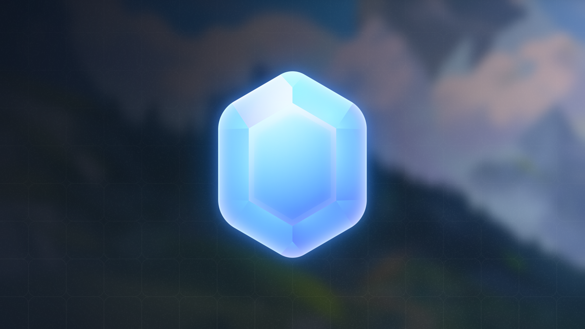

# 💎 Gems

Gems are a currency in Treasure that are earned through gameplay and participation in activities across the ecosystem with quests provisioned through the Treasure App and Portal. Actively earn Gems by diving into quests and competing in tournaments.

They are redeemable for a plethora of rewards and benefits. Actively earn Gems by diving into quests and competing in tournaments.

<figure><figcaption></figcaption></figure>

## The Origin of Gems

Gems are a naturally occurring resource that players can earn by completing quests and bounties, as well as achieving impressive feats like topping the leaderboards or winning tournaments.

As a result of their shiny exterior, sapphire hue, and other reasons unknown, they are highly coveted by [Meem](https://x.com/meemtreasure), a recurring character within the Treasure universe known for his entrepreneurial endeavors as The Wandering Merchant.

In his pursuit to obtain as many Gems as possible, Meem has assembled Treasure Chests filled with items he's found on his adventures throughout Bridgeworld with the hopes of exchanging these for the precious blue crystals.&#x20;

<figure><figcaption></figcaption></figure>

<strong>What are Gems in the Treasure ecosystem?</strong>

Gems are exclusive rewards earned through various activities within the Treasure ecosystem, available on both the Treasure App and the Treasure Portal. They are used initially to unlock Treasure Chests that are filled with special game assets.

<strong>How can I earn Gems?</strong>

You can earn Gems by:

* **Completing Quests**: Finish quests available on the Portal and App.
* **Participating in Tournaments**: Compete in various platform tournaments.

<strong>Where can I see the number of Gems I've earned?</strong>

Your total Gem count is displayed in the top navigation within the app or portal. Additionally, you can view your rank on the leaderboard to compare your Gem count with other members.

<strong>How do I use my Gems?</strong>

To use your Gems, visit the '[Rewards](https://app.treasure.lol/rewards)' section found in the navigation panel. Here, you can browse through various items and benefits and select the ones you want to redeem.

<strong>How do I redeem Gems for rewards?</strong>

1. Select the reward you desire in the ['Rewards' section](https://app.treasure.lol/rewards) on the Treasure App.
2. Click the 'Claim' button to proceed with redemption.
3. The required number of Gems will be deducted from your balance upon confirmation.

<strong>Will there be new rewards to redeem with Gems?</strong>

Yes, the [Rewards section](https://app.treasure.lol/rewards) receives regular updates with new items and offers. Keep an eye on the section to grab exclusive deals and content available only to Gem holders.

<strong>What’s the significance of earning Gems?</strong>

Gems reflect your active participation and achievements within the Treasure community of games. They not only provide a richer experience but also grant access to content that lets you showcase and flaunt your success to fellow gamers.

<strong>How can I get started with earning and using Gems?</strong>

Simply participate in the various quests listed on the [Treasure App](https://app.treasure.lol/quests) or [Portal](https://portal.treasure.lol/quests) to start earning Gems. Then explore the [Rewards section](https://app.treasure.lol/rewards) to use your Gems.

