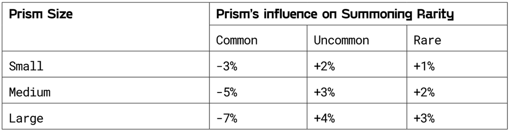

# 🔮 Treasure Portal

Welcome to the Treasure Portal, your entry point to discover the Treasure Chain throughout various testnet versions and, eventually, mainnet.&#x20;

<figure><figcaption></figcaption></figure>

Here’s a quick guide to get you started:

1. **Connect Your Wallet:** Begin by linking your Ethereum-compatible wallet to access all of Treasure Portal's features.
2. **Collect Testnet MAGIC:** Use the Faucet to receive MAGIC tokens on the testnet, essential for transactions and testing within the portal.
3. **Bridge Assets:** Seamlessly transfer MAGIC tokens between networks with our intuitive Bridge tool, allowing you to move assets for testing purposes.
4. **Mint NFTs:** Explore the minting feature to create or acquire unique NFTs on our platform, showcasing your assets.
5. **Explore Quests:** Complete testnet quests that guide you through the platform's functionality and reward you with Shards for your participation.
6. **Check Transactions:** Keep an eye on your activity through the Transactions section, ensuring all your actions are successfully executed.

Use [this link](https://portal-testnet.treasure.lol/) to dive into the Treasure Portal and start your adventure today—explore, play, and contribute to the ever-evolving gaming ecosystem.
